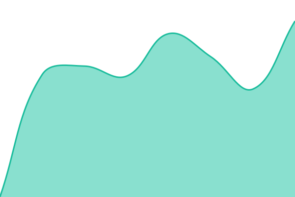
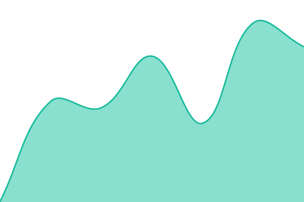

# [Clean Energy Exchange Status](https://cleanenergyexchange.github.io/status)

Uptime monitor and status page for Clean Energy Exchange's public services,
powered by [Upptime](https://github.com/upptime/upptime).

The live status table below is generated automatically by Upptime.

<!--start: status pages-->
<!-- This summary is generated by Upptime (https://github.com/upptime/upptime) -->
<!-- Do not edit this manually, your changes will be overwritten -->
<!-- prettier-ignore -->
| URL | Status | History | Response Time | Uptime |
| --- | ------ | ------- | ------------- | ------ |
|  [API](https://api.prod.ceex.app/api/v1/health) | 🟩 Up | [api.yml](https://github.com/cleanenergyexchange/status/commits/HEAD/history/api.yml) | 

 691ms
     
 | 

<a href="https://status.ceex.app/history/api">100.00%</a>
    

|  [Dashboard](https://prod.ceex.app) | 🟩 Up | [dashboard.yml](https://github.com/cleanenergyexchange/status/commits/HEAD/history/dashboard.yml) | 

 436ms
     
 | 

<a href="https://status.ceex.app/history/dashboard">100.00%</a>
    

<!--end: status pages-->

## License

- Code: [MIT](./LICENSE) © Clean Energy Exchange
- Powered by [Upptime](https://github.com/upptime/upptime)
